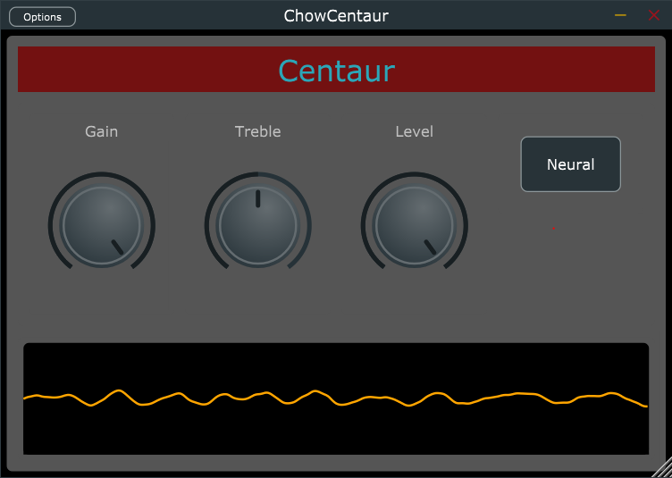
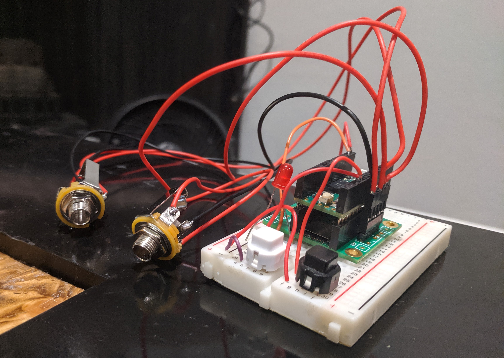

# Klon Centaur Model


[](https://opensource.org/licenses/BSD-3-Clause)
[](https://somsubhra.github.io/github-release-stats/?username=jatinchowdhury18&repository=KlonCentaur&page=1&per_page=30)
[](https://arxiv.org/abs/2009.02833)


This repository contains a digital model of the Klon
Centaur  guitar pedal. The model is constructed using
a variety of circuit modelling techniques, including
nodal analysis, wave digital filters, and recurrent
neural networks. The model is implemented as an audio
plugin  (Standalone/VST/AU/LV2) for desktop and iOS, and as
a guitar pedal-style effect embedded on a Teensy microcontroller.
This work began as part of a class project for
[EE 292D](https://ee292d.github.io/) at Stanford University.

### Quick Links:
- [Latest Release](https://chowdsp.com/products.html#centaur)
- [ChowCentaur for iOS](https://apps.apple.com/us/app/chowcentaur/id1547671733)
- [Nightly Builds](https://chowdsp.com/nightly.html#centaur)
- Presentation at the 2020 [Audio Developer Conference](https://youtu.be/FeS6wQJ6mYI)
- Technical paper on the
[ArXiv](https://arxiv.org/abs/2009.02833)
- [Video Demo](https://youtu.be/yo4JrceDQ2w)

## Audio Plugin



The latest release can be downloaded from
[our website](https://chowdsp.com/products.html#centaur).
ChowCentaur for iOS can be downloaded from the
[app store](https://apps.apple.com/us/app/chowcentaur/id1547671733).
The latest builds (potentially unstable) can be
found on our
[Nightly Builds](https://chowdsp.com/nightly.html#centaur)
page. Linux users can find builds available on the
[Open Build Service](https://build.opensuse.org/package/show/home:kill_it:JUCE/ChowCentaur),
courtesy of Konstantin Voinov.

### Building from Source

To build the audio plugin, you must have CMake installed 
(version 3.15 or greater). Then use the following steps:
```bash
# clone repository
$ git clone https://github.com/jatinchowdhury18/KlonCentaur.git
$ cd KlonCentaur
$ git submodule update --init --recursive

# Build with CMake
$ cmake -Bbuild
$ cmake --build build/ --config Release
```

ChowCentaur also has a headless mode that contains a performance
benchmarking app. You can run the benchmarks yourself as follows:
```bash
# build with CMake
$ cmake -Bbuild -DBUILD_CENTAUR_HEADLESS=ON
$ cmake --build build/ --config Release --target Centaur_Headless

# run benchmarks
$ ./build/ChowCentaurHeadless bench
```

For more information, run `./build/ChowCentaurHeadless bench --help`.

ChowCentaur uses the
[RTNeural](https://github.com/jatinchowdhury18/RTNeural) 
neural network inferencing engine for running
computing the output of a recurrent neural network
in real-time. RTNeural has three available computational
backends: `Eigen`, `xsimd`, and `STL`. By default,
ChowCentaur uses the `xsimd` backend, but that can
be changed using a different `CMake` configuration
command, for example: `cmake -Bbuild -DRTNEURAL_EIGEN=ON`.


## Teensy Pedal

Check out the video demo on [YouTube](https://youtu.be/c8CoRClYGIY)!
For more information on the Teensy pedal-style implementation, see the
[`TeensyCentaur/`](./TeensyCentaur/) subfolder.



## Circuit Modelling

The circuit model is constructed using nodal analysis and wave digital
filters. For more information see:

- Julius Smith, [Physical Audio Signal Processing](https://ccrma.stanford.edu/~jos/pasp/pasp.html)
- Kurt Werner, [Virtual Analog Modelling of Audio Circuitry Using Wave Digital Filters](https://www.semanticscholar.org/paper/Virtual-Analog-Modeling-of-Audio-Circuitry-Using-Werner/4df7106aa5581a607ac88e559a05c71efc73497b)

The wave digital filters are implemented using a WDF library, available
[here](https://github.com/jatinchowdhury18/WaveDigitalFilters).

## Neural Network Modelling

In the neural network version of the emulation, a recurrent neural network
is used to emulate the gain stage circuit of the original pedal. The
RNN architecture used is derived from the one presented by Wright et. al.
in their 2019 DAFx paper ["Real-Time Black-Box Modelling with Recurrent Neural Networks"](http://dafx2019.bcu.ac.uk/papers/DAFx2019_paper_43.pdf).
Training data consists of ~4 minutes of Direct In (DI) recordings of 
electric guitar, chopped into 0.5 second segments. The data is then 
processed through a SPICE model to create a "ground truth" version of the
effect to train against. The training data, SPICE model, and `Python` code
for training the networks can be found in the
[`GainStageML/`](./GainStageML/) subfolder.

## License

This repository is licensed under the 
BSD-3-Clause license. Enjoy!
