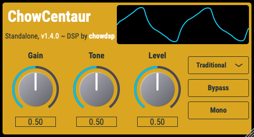

# Klon Centaur Model

[](https://travis-ci.com/jatinchowdhury18/KlonCentaur)

This repository contains a digital model of the Klon Centaur 
guitar pedal. The goal is to use this circuit as a test
bench for comparing/combining nodal analysis, wave 
digital filters, and neural network circuit modelling
approaches. The model is implemented as an audio plugin 
(Standalone/VST/AU), and as a guitar pedal-style effect
embedded on a Teensy microcontroller.

A full technical paper summarizing this project is available on the
[ArXiv](https://arxiv.org/abs/2009.02833).
Original circuit schematic and analysis on
[ElectroSmash](https://www.electrosmash.com/klon-centaur-analysis).

This work began as part of a class project for
[EE 292D](https://ee292d.github.io/) at Stanford University.

## Audio Plugin



Plugin builds can be downloaded from the
[releases page](https://github.com/jatinchowdhury18/KlonCentaur/releases).
Check out the video demo on [YouTube](https://youtu.be/yo4JrceDQ2w).
Linux users can find builds available on the
[Open Build Service](https://build.opensuse.org/package/show/home:kill_it:JUCE/ChowCentaur),
courtesy of Konstantin Voinov.

### Building from Source

To build the audio plugin, you must have CMake installed 
(version 3.15 or greater). Then use the following steps:
```bash
# clone repository
$ git clone https://github.com/jatinchowdhury18/KlonCentaur.git
$ cd KlonCentaur
$ git submodule update --init --recursive

# Build with CMake
$ cmake -Bbuild
$ cmake --build build/ --config Release
```

If you also want to build the sub-circuits and performance
benchmarking app included in this repo, using the following
as your first CMake command: `cmake -Bbuild -DBUILD_SUB_CIRCUITS=ON -DBUILD_CENTAUR_BENCH=ON`.

The neural network inferencing engine used by the plugin has
two implementations, one using the
[`Eigen`](http://eigen.tuxfamily.org/) linear algebra library,
and a second using only the C++ standard library (STL). The 
`Eigen` implementation is enabled by default, but if you would 
prefer to use the STL implementation, comment out the
following line in `CMakeLists.txt`:

```CMake
# comment to use STL implementation instead of Eigen
add_definitions(-DUSE_EIGEN)
```


## Teensy Pedal

Check out the video demo on [YouTube](https://youtu.be/c8CoRClYGIY)!
For more information on the Teensy pedal-style implementation, see the
[`TeensyCentaur/`](./TeensyCentaur/) subfolder.


## Circuit Modelling

The circuit model is constructed using nodal analysis and wave digital
filters. For more information see:

- Julius Smith, [Physical Audio Signal Processing](https://ccrma.stanford.edu/~jos/pasp/pasp.html)
- Kurt Werner, [Virtual Analog Modelling of Audio Circuitry Using Wave Digital Filters](https://www.semanticscholar.org/paper/Virtual-Analog-Modeling-of-Audio-Circuitry-Using-Werner/4df7106aa5581a607ac88e559a05c71efc73497b)

The wave digital filters are implemented using a WDF library, available
[here](https://github.com/jatinchowdhury18/WaveDigitalFilters).

## Neural Network Modelling

In the neural network version of the emulation, a recurrent neural network
is used to emulate the gain stage circuit of the original pedal. The
RNN architecture used is derived from the one presented by Wright et. al.
in their 2019 DAFx paper ["Real-Time Black-Box Modelling with Recurrent Neural Networks"](http://dafx2019.bcu.ac.uk/papers/DAFx2019_paper_43.pdf).
Training data consists of ~4 minutes of Direct In (DI) recordings of 
electric guitar, chopped into 0.5 second segments. The data is then 
processed through a SPICE model to create a "ground truth" version of the
effect to train against. The training data, SPICE model, and `Python` code
for training the networks can be found in the
[`GainStageML/`](./GainStageML/) subfolder.

## License

This repository is licensed under the 
BSD-3-Clause license. Enjoy!
